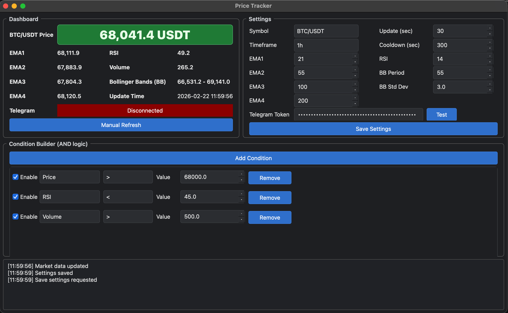

# PriceTracker

`PyQt6` 桌面價格追蹤器，可監控價格與技術指標，並透過 Telegram 發送提醒。

## Screenshot



## 主要功能

- 交易標的：`BTC/USDT`、`ETH/USDT`、`0050.TW`、`0056.TW`、`SPY`、`QQQ`、`DIA`、`VOO`、`IVV`
- 指標：`EMA1~EMA4`、`RSI`、`Volume`、`Bollinger Bands (BB)`
- 條件式提醒：可堆多條件（AND 邏輯）
- Telegram 通知：支援自動偵測 `chat_id`（使用者不用手動輸入）
- 自動更新：依 `Update(sec)` 週期背景更新
- 無資料源時（例如休市）：Dashboard 以 `-` 顯示

## 安裝與啟動

```bash
pip install -r requirements.txt
python main.py
```

可選參數：
- `--profile <name>`：使用 `settings.<name>.json`
- `--config <path>`：指定完整設定檔路徑

環境變數：
- `PRICE_TRACKER_CONFIG=<path>`

## Telegram 設定教學

1. 到 Telegram `@BotFather` 建立 bot，取得 `token`
2. 在 PriceTracker 的 `Telegram Token` 輸入 token，按 `Save Settings`
3. 到你的 bot 對話視窗（例如 `@xxxx_bot`）送出 `/start`
4. 回到 PriceTracker，按 `Save Settings` 或 `Test`
5. 若成功，Dashboard 的 `Telegram` 會顯示 `Connected`（綠色）

注意：
- 本程式不需要手動輸入 `chat_id`
- `chat_id` 會在背景同步更新時自動抓取並保存
- 若顯示 `Waiting for chat_id`，通常是尚未對 bot 發送 `/start`

## PriceTracker 使用流程

1. 在 `Settings` 選擇 `Symbol` 與 `Timeframe`
2. 設定 `Update(sec)` 與 `Cooldown(sec)`
3. 調整指標參數（EMA1~EMA4、RSI、BB）
4. 按 `Save Settings`
5. 按 `Add Condition` 增加條件，勾選 `Enable`
6. 條件成立時會依 cooldown 發送 Telegram 訊息
7. 可按 `Manual Refresh` 手動刷新（不影響背景自動更新）

條件欄位說明：
- 左側：指標（Price/RSI/EMA/Volume/BB）
- 中間：運算子（`>`, `<`, `>=`, `<=`, `==`, `Cross Above`, `Cross Below`）
- 右側：比較數值 `Value`

## 打包（含版本號）

### macOS

```bash
bash scripts/build_macos.sh all -v 1.0
```

會產生：
- `dist/PriceTracker-1.0.app`
- `dist/PriceTracker-1.0.dmg`
- `dist/PriceTracker-1.0.pkg`

### Windows

```bat
scripts\build_windows.bat exe -v 1.0
```

Windows 打包注意事項：

- 打包腳本必須使用 CPython（python.org 版本），不要使用 Conda Python。
- 若 `.build-venv` 是由 Conda 建立，請先執行 `scripts\build_windows.bat clean` 後再重打包。
- 可透過環境變數強制指定 Python 解譯器：

```bat
set PRICE_TRACKER_CPYTHON=C:\Users\<your_user>\AppData\Local\Programs\Python\Python313\python.exe
scripts\build_windows.bat clean
scripts\build_windows.bat exe -v 1.0
```

常見錯誤：

- `[ERROR] .build-venv was created from Conda Python ...`
  - 原因：現有 venv 是用 Conda 建立。
  - 解法：先 `clean`，再用 CPython 重建後打包。
- `[ERROR] Bootstrap CPython path is empty.`
  - 原因：找不到 CPython，或 `PRICE_TRACKER_CPYTHON` 是空值 / 無效路徑。
  - 解法：設定正確的 `python.exe` 路徑後重新執行。

## 設定檔位置

### Source 直接執行

- 預設：當前目錄 `./settings.json`
- `--profile dev`：`./settings.dev.json`

### 打包版（macOS / Windows）

- 先嘗試「程式所在資料夾」
- 若該目錄不可寫，才 fallback
- macOS：`~/Library/Application Support/PriceTracker/settings.json`
- Windows：`%APPDATA%\PriceTracker\settings.json`

注意：`settings.json` 不會預先打包進 app，使用者第一次儲存時才建立。

## 同時開多個實例（不同 settings.json）

### 方法 1：`--profile`（推薦）

macOS：

```bash
open -n "/path/to/PriceTracker.app" --args --profile a
open -n "/path/to/PriceTracker.app" --args --profile b
```

Windows：

```bat
start "" "C:\path\PriceTracker.exe" --profile a
start "" "C:\path\PriceTracker.exe" --profile b
```

### 方法 2：`--config` 指定完整路徑

macOS：

```bash
open -n "/path/to/PriceTracker.app" --args --config "/path/to/cfg/trader1.json"
open -n "/path/to/PriceTracker.app" --args --config "/path/to/cfg/trader2.json"
```

Windows：

```bat
start "" "C:\path\PriceTracker.exe" --config "C:\cfg\trader1.json"
start "" "C:\path\PriceTracker.exe" --config "D:\cfg\trader2.json"
```

## 備註

- 直接雙擊同一個 app / exe（不帶參數）會共用同一份預設設定檔
- Telegram 連線與發送採背景執行，不應卡住 UI
